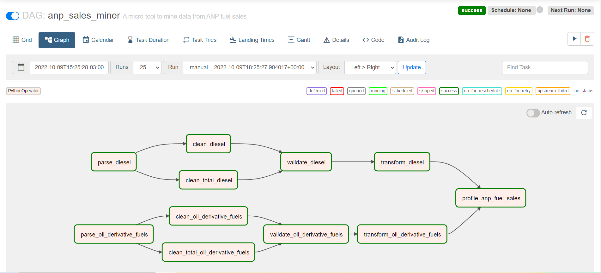
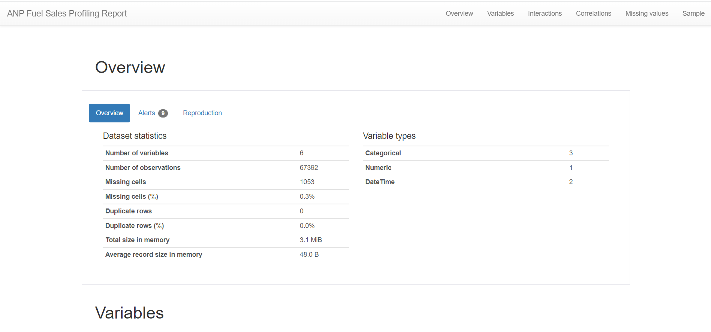

# ANP Sales Miner


[](https://github.com/pmhaddad/anp_sales_miner/actions/workflows/test.yml)

This project is aimed to solve the **Data Engineering Test** [available here](https://github.com/raizen-analytics/data-engineering-test)



## What do you need to run this tool?

You will need [Docker](https://www.docker.com/) and [Docker Compose](https://docs.docker.com/compose/)

## How do you run this tool?

Here is a step-by-step guide on how to run this project's tool:

* Clone this repository on a directory within your machine.
* Make sure Docker is running on the background
* Navigate to the repository's directory and build project's image:

  ```{bash}
  docker compose build
  ```

* Create an user and a password to log into Airflow's webserver (this command will also init Airflow's database):

    ```{bash}
    docker compose run anp_sales_miner pipenv run airflow users create --username admin --firstname YOUR_NAME --lastname YOUR_SURNAME --role Admin --email dummy_admin@my_airflow.com
    ```

  > **Note**: This step is only needed when running the project for the first time!
* Launch the container with Airflow's **webserver**

  ```{bash}
  docker compose up -d
  ```

* Launch Airflow's **scheduler**

  ```{bash}
  docker compose run anp_sales_miner pipenv run airflow scheduler
  ```

* Login into [Airflow's webserver](http://localhost:8080)
* Run the pipeline DAG as wanted (e.g. by turning the `anp_sales_miner` DAG on and triggering a run)
* Wait the results

To end a running session of the tool, reverse the operations as:

* Kill the **scheduler**

  ```{bash}
  CTRL+C
  ```

* Kill the **webserver**

  ```{bash}
  docker compose down
  ```

## How can I see the output data?

* Data will be saved on the `transformed` step of the `datalake` folder.
* **A HTML report is always generated as the final step of the pipeline** under the `reports` folder. So you can easily peak the results there



## Future improvements

* Reduce Docker image size

## Where does this solution come from?

The most challenging part was to extract the pivot cache data from the `.xls` file. Inspiration for this project came from here:

* [Stack Overflow question on VBA](https://stackoverflow.com/questions/1442316/recreate-source-data-from-pivottable-cache)
* [Stack Overflow question on Python](https://stackoverflow.com/questions/59330853/how-to-extract-excel-pivotcache-into-pandas-data-frame)

---

  > **Note**: The conversion from `.xls` to `xlsx` is not being done within the pipeline. The pipeline in running on an already-converted-to-xlsx copy of the raw `.xls`</br>
  > The script used to perform such conversion is shipped within this project, and can be run independently as a Python script, in case someone wants to see how this step works (although it is not needed)</br>
  > The converter is stored under `anp_sales_miner.helpers.xls_converter.py`: [easy link here](anp_sales_miner/helpers/xls_converter.py)</br>
  > **A current limitation is that the conversion script can only be run on a Windows Python installation**, since it depends on the `win32` library. So, to run it, you will need those three components, but that is it</br>
